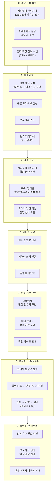
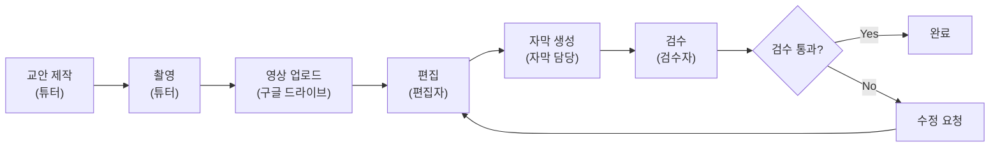

# PM 워크플로우 — 강의 제작 전 과정

> PM(Tutor Relations PM)의 관점에서 강의 제작 프로젝트 한 건이 시작부터 종료까지 어떻게 흘러가는지를 정리한 문서다. 실제 노션 운영 데이터를 기반으로 작성했다.

---

## 전체 흐름 요약




---

## Phase 0. 제작 요청 접수

### PM이 하는 일

```
커리큘럼 매니저 → [EduOps에서 구인 요청] → PM에게 "제작 일정 공유 폼" 전달
                                         → TRM이 "튜터 확정 정보" 공유
```


| 단계      | PM의 액션                       | 확인 사항                                                        |
| ------- | ---------------------------- | ------------------------------------------------------------ |
| 폼 수신    | 강의명, 챕터 수, 예상 분량, 롤아웃 목표일 확인 | 사용처(KDT/KDC/신사업), 제작 유형(신규/리뉴얼)                              |
| 튜터 확정   | TRM으로부터 튜터명, 슬랙 계정 수신        | 챕터별 담당 튜터가 다를 수 있음 (실제 데이터: GPT웹개발 → 구민정 CH1~~3, 박성훈 CH4~~5) |
| 프로젝트 생성 | 관리 시스템에 신규 프로젝트 등록           | 강의명 형식: `(v버전) 강의제목`                                         |


### 실제 사례

```
(v1.0) 실시간 채팅을 위한 아키텍쳐 설계
├─ 사용처: KDT
├─ 담당자: 장수미(KDT교육운영팀)
├─ 튜터: 김동현
├─ 롤아웃: 2026-02-13
└─ 강의 지급일: 2026-02-23
```

---

## Phase 1. 환경 세팅

### PM이 하는 일

```
PM ──┬── 슬랙 채널 생성 (#콘텐츠_강의제작_강의명)
     │     └── 참여자 초대: 튜터, 커리큘럼 매니저, (이후) 편집자, 검수자
     │
     ├── 구글 드라이브 폴더 생성
     │     └── 촬영 영상 업로드 공간
     │
     ├── 백오피스에 강의 등록
     │     └── 신규 강의 생성 또는 기존 강의 버전 업
     │
     └── 관리 페이지에 모든 링크 임베드
           ├── 백오피스 URL
           ├── 구글 드라이브 URL
           ├── 교안 URL
           └── 커리큘럼 시트 URL
```

### 현재 문제점 (AS-IS)

- 노션 프로젝트 페이지 생성 + 슬랙 바로가기 폴더 + 캔버스 등 **여러 곳에 수동 세팅**
- 링크가 분산되어 있어서 나중에 찾기 어려움

---

## Phase 2. 일정 산정

### PM이 하는 일

이 단계가 PM의 **가장 핵심적인 작업**이다. 롤아웃 목표일로부터 역산하여 챕터별 일정을 산정한다.

```
롤아웃 목표일 (예: 2026-02-13)
  ↑ 강의 롤아웃
  ↑ CH4 검수 완료  ← 2일
  ↑ CH4 편집 완료  ← 3일
  ↑ CH4 촬영 완료  ← 2일
  ↑ CH3 검수 완료  ← 2일
  ↑ ...
  ↑ CH1 촬영 시작  ← 역산 결과: 2026-01-31
  ↑ 리허설 촬영     ← 2026-01-26
  ↑ CH1 교안 제작   ← 2026-01-27
```

### 실제 일정 산정 패턴 (데이터 기반)

아래는 `(v1.0) 실시간 채팅을 위한 아키텍쳐 설계` (4챕터, 약 7시간)의 실제 일정이다:

```
[자료 조사 & 프로젝트 준비]  1/21 ─────── 1/26
[목차 설계]                                 1/16
[리허설 촬영]                        1/26 ── 1/27

[CH1 교안]  1/27 ── 1/29
[CH1 촬영]         1/29 ── 1/30
[CH1 편집]                1/30 ──── 2/2
[CH1 검수]                1/30 ──── 2/2

[CH2 교안]         1/31 ──── 2/2
[CH2 촬영]                2/2 ── 2/3
[CH2 편집]                     2/3 ──── 2/6
[CH2 검수]                     2/3 ──── 2/6

[CH3 교안]                2/4 ──── 2/6
[CH3 촬영]                     2/6 ── 2/7
[CH3 편집]                          2/7 ── 2/9
[CH3 검수]                          2/7 ── 2/9

[CH4 교안]                     2/5 ──── 2/8 ── 2/10
[CH4 촬영]                               2/10 ── 2/11
[CH4 편집]                                     2/10 ── 2/12
[CH4 검수]                                     2/10 ── 2/12

[강의 롤아웃]                                              2/13
```

### 핵심 포인트

1. **챕터 간 파이프라이닝**: CH1 편집이 진행되는 동안 CH2 촬영을 병행 (완전 직렬이 아님)
2. **편집·검수 병행**: 편집과 검수가 같은 기간에 시작되는 경우도 있음 (편집 완료 부분부터 순차 검수)
3. **교안 제작 선행**: 촬영보다 교안이 먼저 완료되어야 하므로 교안→촬영 종속성 필수
4. **D-day 모니터링**: PM은 매일 "오늘 기준으로 각 태스크가 D+몇인지" 확인

---

## Phase 3. 리허설 촬영

### PM이 하는 일

```
PM ──┬── [촬영 1주 전] 사전 준비 확인
     │     └── 크로마키 설정, 카메라 위치, 마이크 테스트
     │
     ├── [촬영 3일 전] 튜터에게 일정 안내
     │
     ├── [촬영 1일 전] 튜터에게 리마인드
     │
     ├── 리허설 촬영 당일 지원
     │
     └── 촬영본 확인 및 피드백
           └── 실제 사례: "브라우저 세팅, 카메라 위치 유의!" (클라우드 백엔드 CH4)
           └── 실제 사례: "키보드 타건음 확인 필요 → 목소리가 묻히는 정도는 아니라 재촬영 필요 X" (GPT웹개발 CH2)
```

### 리허설 시 확인 체크리스트

- 화면 해상도 및 FPS 기준 충족 여부
- 음향 품질 (울림, 잡음, 타건음)
- 크로마키 / 배경 설정 상태
- 교안과 실제 촬영 내용 일치 여부

---

## Phase 4. 편집/검수 구인 및 업무 안내

### PM이 하는 일

```
PM ──┬── 슬랙 편집/검수 채널에서 구인 공고
     │
     ├── 지원자 과제 평가
     │
     ├── 편집자/검수자 확정
     │     ├── 슬랙 강의 채널에 초대
     │     └── 작업 페이지 접근 권한 부여
     │
     └── 업무 안내
           ├── 편집/검수 가이드 공유
           ├── 구글 드라이브 접근 안내
           └── 작업 일정 및 마감일 안내
```

### 실제 편집자/검수자 배정 현황 (데이터 기반)


| 역할  | 이름  | 동시 담당 강의 수 |
| --- | --- | ---------- |
| 편집자 | 강태경 | 4~5개       |
| 편집자 | 최종균 | 3~4개       |
| 편집자 | 유민석 | 2~3개       |
| 검수자 | 유재성 | 5~6개       |
| 검수자 | 박기태 | 2~3개       |


> 한 사람이 여러 강의를 동시에 담당하므로, PM은 배정 시 해당 담당자의 현재 업무량을 확인해야 한다.

---

## Phase 5. 본촬영 + 편집/검수

이 단계가 **가장 길고 PM의 팔로업이 집중되는** 구간이다.

### 챕터 1건의 생애주기




### PM의 일상 루틴 (이 단계에서)

```
매일 아침:
  1. 관리 페이지 열기
  2. 오늘 마감인 태스크 확인
  3. 지연되고 있는 태스크 확인 (D+N 체크)
  4. 해당 담당자에게 슬랙으로 팔로업
  
촬영 완료 시:
  1. 구글 드라이브에 영상 업로드 확인
  2. 촬영 태스크 상태를 "완료"로 변경
  3. 편집자에게 슬랙으로 작업 시작 안내
  4. 편집 태스크 상태를 "진행"으로 변경

편집 완료 시:
  1. 편집 태스크 상태를 "완료"로 변경
  2. 검수자에게 슬랙으로 검수 요청
  3. 검수 태스크 상태를 "진행"으로 변경

검수 이슈 발생 시:
  1. 검수자의 피드백 확인
  2. 편집자에게 수정 요청 전달
  3. 설명 필드에 이슈 내용 기록
     예: "12/31~1/5: 촬영/편집/검수 작업 → 1/5: 작업 중단 (재촬영 필요) → 1/7: 촬영 예정"
```

### 실제 이슈 사례 (데이터에서 추출)


| 강의               | 이슈                      | PM 대응                                  |
| ---------------- | ----------------------- | -------------------------------------- |
| Python & SQL CH3 | 촬영/편집/검수 진행 중 재촬영 필요 판단 | 1/5 작업 중단 → 1/7 재촬영 → 편집/검수 재개         |
| GPT 웹개발 CH2      | 키보드 타건음 확인 필요           | 목소리 묻히는 정도 아님 → 재촬영 불필요 판단, 추후 음향개선 확인 |
| 클라우드 백엔드 CH4-3   | 울림 현상                   | 음향개선 요청 → 울림통 더 커짐 → 추가 대응 필요          |
| 클라우드 백엔드 CH4     | 브라우저 세팅, 카메라 위치 문제      | 사전 유의사항으로 기록하여 촬영 전 리마인드               |


---

## Phase 6. 롤아웃 및 마무리

### PM이 하는 일

```
PM ──┬── 전체 챕터 검수 완료 최종 확인
     │
     ├── 커리큘럼 매니저에게 백오피스 공유
     │     └── 백오피스 상태를 '제작완료'로 변경
     │
     ├── 관계자 마무리 안내
     │     ├── 튜터: 촬영 완료 확인 및 감사
     │     ├── 편집자: 최종 편집본 확인
     │     └── 검수자: 검수 완료 확인
     │
     └── 후속 작업
           ├── 비용 정산 데이터 정리 (강의 지급일 기준)
           └── 프로세스 회고 (KPT)
```

### 실제 롤아웃 일정 vs 실제 완료일


| 강의                  | 계획 롤아웃     | 실제 완료      | 차이  |
| ------------------- | ---------- | ---------- | --- |
| (v2.0) GPT 웹개발      | 2025-12-31 | 2025-12-31 | 정시  |
| (v1.0) Python & SQL | 2026-01-16 | 2026-01-16 | 정시  |
| (v1.0) 실시간 채팅 아키텍쳐  | 2026-02-13 | 2026-02-13 | 정시  |
| (v2.0) 클라우드 백엔드     | 2026-03-04 | 2026-03-04 | 정시  |


> 현재까지 완료된 프로젝트들은 모두 정시 롤아웃에 성공했다. 이는 PM이 수동으로 촘촘하게 팔로업한 결과이나, 동시 관리 프로젝트 수가 늘어나면 리스크가 커진다.

---

## PM이 동시에 관리하는 것들

실제 데이터 기준, PM(박진영)이 2026년 3월 시점에서 **동시에 관리 중인 항목**:

```
진행 중인 강의 프로젝트:
  ├── (v1.0) 부업을 부르는 AI PPT 수익화    🟠 (W4 이내 완료)
  ├── (v1.0) 스파르타 C언어                  🟢 (한달 이상)
  ├── (v1.0) 스파르타 C++                    🟢 (한달 이상)
  ├── (v1.3) 데이터 이해와 AI 기반 성과 분석  🟠 (W3 이내 완료)
  └── 시작 전: 결제 시스템, 마케팅 실무의 이해

이번 주 팔로업 필요 태스크 (C언어 기준):
  ├── CH1 검수 - 진행 중
  ├── CH2 검수 - 진행 중
  ├── CH3 검수 - 진행 중
  ├── CH4 검수 - 진행 중
  ├── CH5 검수 - 진행 중
  ├── CH6 자막/검수 - 진행 중
  ├── CH7 자막/검수 - 진행 중
  ├── CH9 편집 - 진행 중
  ├── CH10 편집 - 진행 중
  └── CH11 편집 - 진행 중

동시에 관리하는 편집자/검수자:
  ├── 편집: 강태경, 최종균, 유민석, 박기태, 최서윤, 임동섭 ...
  └── 검수: 유재성, 김휘수, 전기연 ...
```

> **핵심 문제**: 이 모든 것을 노션 + 슬랙 + 머릿속으로 관리하고 있다. 강의 수가 늘어날수록 누락 위험이 기하급수적으로 증가한다.

---

## PM 워크플로우에서 시스템이 해결해야 할 것


| PM의 현재 행동             | 빈도         | 시스템이 대체할 부분                        |
| --------------------- | ---------- | ---------------------------------- |
| 매일 아침 전체 프로젝트 상태 확인   | 매일         | **대시보드** — 오늘 마감 태스크, 지연 태스크 자동 표시 |
| D-day 수동 계산           | 매일         | **자동 D-day 카운팅** 및 색상 경고           |
| 촬영 완료 → 편집자에게 슬랙 메시지  | 태스크 완료 시마다 | **상태 변경 시 자동 알림**                  |
| 편집자/검수자 배정 시 업무량 확인   | 프로젝트 시작마다  | **워크로드 뷰**                         |
| 롤아웃까지 역산 일정 수동 계산     | 프로젝트 시작마다  | **일정 템플릿 자동 생성**                   |
| 이슈 발생 시 노션 설명란에 수기 기록 | 수시         | **이슈 트래킹 기능**                      |
| 신호등(🟢🟠) 수동 판단 및 변경  | 수시         | **자동 건강도 계산**                      |
| 비용 정산 데이터 수동 취합       | 매월         | **정산 자동 집계** (P0)                  |


