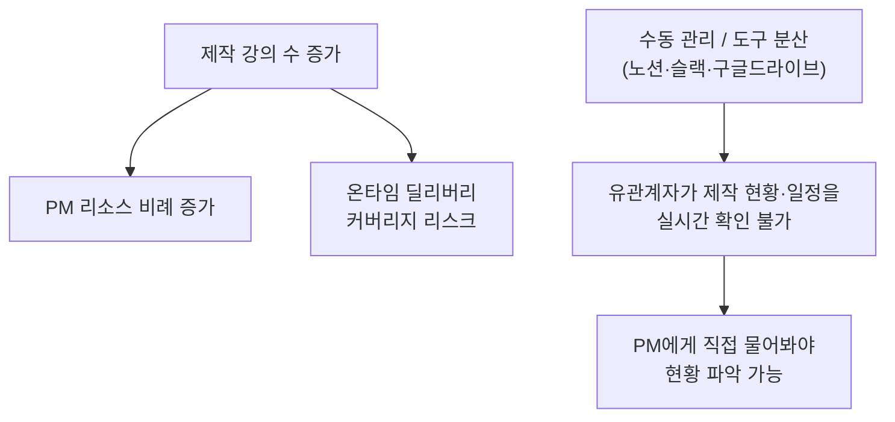
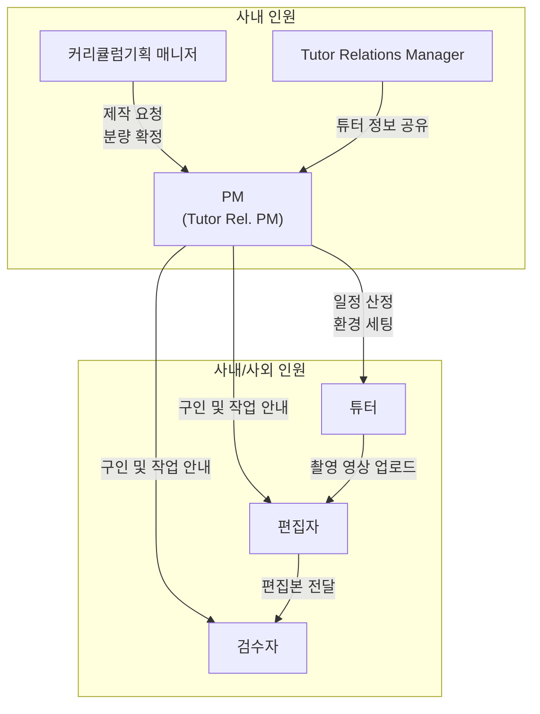
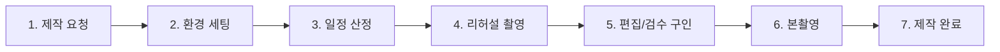
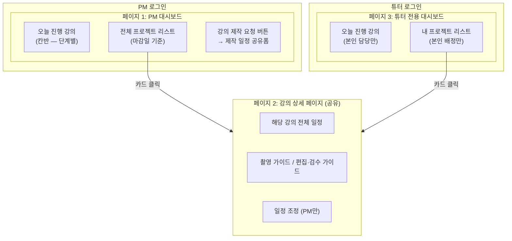
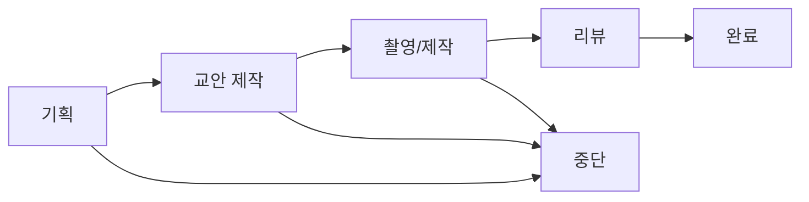
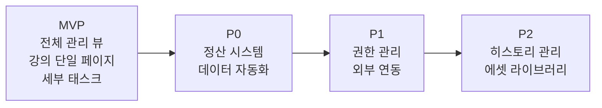

# CourseFlow - 강의 제작 관리 시스템

> 품질이 보장된 온라인 강의의 온타임 딜리버리(On-time Delivery)를 실현하는 것

---

## 🚀 백엔드 개발 착수 시 먼저 읽을 문서

| 문서 | 역할 |
|------|------|
| [policies/정책-초안.md](policies/정책-초안.md) | **메인 비즈니스 정책**. 상태 전이, 권한, Drive 구조, 슬랙 템플릿 등 모든 룰 |
| [policies/API-스키마.md](policies/API-스키마.md) | **API 계약서**. 엔티티 필드, 엔드포인트 Request/Response |
| [policies/백엔드-할일.md](policies/백엔드-할일.md) | 백엔드가 구현해야 할 항목 체크리스트 |
| [policies/미결정-정책.md](policies/미결정-정책.md) | 답변 필요한 남은 질문 (백엔드 개발 시점 결정 항목 포함) |
| [policies/README.md](policies/README.md) | 정책 디렉토리 인덱스 |

진행 계획: [`plans/`](plans/) 폴더 참고.

아래 섹션부터는 **프로젝트 초기 기획 배경** (2026-02 ~ 03). 구현 시에는 위 정책 문서가 우선.

---

## 1. 프로젝트 개요

CourseFlow는 온라인 강의 제작의 전 과정을 체계적으로 관리하는 시스템이다. PM(Project Manager)이 강의 제작 일련의 프로세스를 관리하면서 발생하는 누락을 방지하고, 유관 부서 및 외부 인력이 효율적으로 협업할 수 있는 환경을 제공하는 것이 핵심 목표다.

### 3대 핵심 가치

| 가치 | 설명 |
|---|---|
| **병목 제거** | 기획 → 촬영 → 편집 단계 간 정보가 구조화되어 전달되어, 추가 커뮤니케이션 없이 다음 단계를 즉시 착수 |
| **일정/품질 관리** | 촬영·편집·검수 각 단계의 일정 준수 여부와 품질 기준 충족 여부를 시스템으로 관리 |
| **시스템 중심 협업** | 사람이 아닌 시스템이 진행 상태를 추적하고, 자동 알림으로 관계자 간 정보 격차를 해소 |

---

## 2. 문제 정의와 기대 성과

### 해결하려는 문제

| # | 문제 | 상세 |
|---|---|---|
| 1 | **PM 리소스 비례 증가** | 제작 강의 수가 늘어날수록 PM 리소스가 비례하여 증가하며, 강의 온타임 딜리버리 커버리지를 유지할 수 없는 리스크가 커지고 있음 |
| 2 | **실시간 현황 공유 불가** | 커리큘럼기획 매니저, 운영기획 매니저, 튜터, 편집자, 검수자가 제작 현황 및 일정을 실시간으로 확인할 수 없으며, PM에게 직접 문의해야만 파악 가능 |

### 기대 성과

| 지표 | 목표 |
|---|---|
| **PM 리소스 절약** | 주 7시간 |
| **제작 현황 공유** | 유관계자 실시간 확인 가능 |

### MVP 기능 확정 기준

위 두 가지 문제에서 도출한 기준으로 MVP 기능을 선정한다.

1. **PM 리소스 절약에 직접 기여하는가?** — 수동 반복 작업을 시스템이 대체
2. **유관계자의 실시간 현황 확인을 가능하게 하는가?** — 별도 문의 없이 시스템에서 직접 확인

---

## 3. 관리 범위

다음 3가지 기준을 **모두 충족하는 강의**가 관리 대상이다.

### 사업부 기준

| 사업부 | 대상 | 관련 부서 |
|---|---|---|
| **KDT** | 내일배움캠프 트랙 내 제작 강의 | KDT 교육운영팀 |
| **KDC** | 스파르타클럽 내 단일 판매 강의 | 교육운영실 재직자/KDC 교육운영 파트 |
| **신사업** | 신사업 영역 제작 강의 (부업, 시니어 등) | 교육운영실, B2C사업기획팀, 그로스실 등 |

### 제작 유형 기준

| 유형 | 설명 | 관리 항목 |
|---|---|---|
| **신규 제작** | 커리큘럼 기획부터 촬영, 편집·검수까지 전 과정 (백오피스: 신규 강의 생성) | 일정 / 품질 / 정산 |
| **부분 리뉴얼** | 기존 강의 중 일부 챕터 재촬영·재편집 (버전: n.m → m 변경) | 유지보수: 일정/품질, 신규 추가: 일정/품질/정산 |
| **전체 리뉴얼** | 기존 강의 전면 재촬영 (버전: n.m → n 변경) | 일정 / 품질 / 정산 |

### 제작 공정 기준

| 공정 | 설명 | 비고 |
|---|---|---|
| **촬영 + 편집/검수** | 튜터 촬영과 편집·검수가 연속 진행 | 일정 종속성이 높아 단계 간 병목 관리 필요 |
| **편집/검수만** | 기존 촬영본 활용하여 편집·검수만 진행 | 실시간 강의 VOD 전환, 커리큘럼 재구성 등 |

---

## 4. 이해관계자 및 역할

| 역할 | 담당 업무 |
|---|---|
| **PM (Tutor Rel. PM)** | 전체 제작 프로세스 총괄. 제작 환경 세팅, 일정 산정, 촬영/편집/검수 팔로업, 슬랙 채널 운영 |
| **커리큘럼기획 매니저** | EduOps를 통한 튜터 구인 요청, 목차 설계, 최종 강의 분량 확정, 백오피스 상태 관리 |
| **Tutor Relations Manager** | 튜터 확정 후 튜터 정보(튜터명, 슬랙 계정 등) 공유 |
| **튜터** | 강의 촬영 (리허설 + 본촬영), 일정 리뷰 및 촬영 방식 확인 |
| **편집자** | 촬영 완료 영상의 편집 작업 수행 |
| **검수자** | 편집 완료 영상의 품질 검수 수행 |

---

## 5. 제작 프로세스 (TO-BE)

> 아래 프로세스는 강의 제작에 참여하는 구성원 모두가 강의 제작 시스템을 활용한다는 것을 전제로 한다.

### 1단계: 강의 제작 요청

| 항목 | 내용 |
|---|---|
| **담당** | 커리큘럼기획 매니저, PM |
| **핵심 활동** | EduOps에서 튜터 구인 요청 시 "온라인 강의 제작(VOD)" 선택 → 강의 제작 일정 공유 폼 필수 작성 → 시스템에 신규 프로젝트 자동 생성 |
| **개선 포인트** | 기존에는 PM이 별도로 기획 매니저에게 폼을 요청해야 했으나, 구인 요청 단계에 폼이 통합되어 자동으로 프로젝트 생성 |

- 튜터 확정 후, Tutor Relations Manager가 튜터 정보 공유
- PM이 슬랙 채널(`#콘텐츠_강의제작_강의명`) 생성 및 참여자 초대

### 2단계: 제작 환경 세팅

| 항목 | 내용 |
|---|---|
| **담당** | PM |
| **핵심 활동** | 구글 드라이브 및 백오피스 생성, 강의 제작 시스템에 드라이브·백오피스·교안 링크 임베드 |
| **개선 포인트** | 기존에는 노션 프로젝트 페이지 생성 + 슬랙 바로가기 폴더 등 여러 곳에 수동 세팅이 필요했으나, 시스템 내에서 통합 관리 |

### 3단계: 일정 산정

| 항목 | 내용 |
|---|---|
| **담당** | 커리큘럼기획 매니저, PM, 튜터 |
| **핵심 활동** | 커리큘럼 매니저가 최종 분량을 시스템에 기재 → PM이 챕터별 촬영·편집·검수 일정 산정 → 튜터가 일정 리뷰 및 촬영 방식(스튜디오/자택) 확인 |
| **개선 포인트** | 모든 일정 시작 하루 전 리마인드 알림 자동 발송. 알림 내에서 완료 체크 및 상태 변경 등 후속 액션 즉시 수행 가능 |

### 4단계: 리허설 촬영

| 항목 | 내용 |
|---|---|
| **담당** | PM, 튜터 |
| **핵심 활동** | 본촬영 전 리허설 촬영 진행 |
| **개선 포인트** | 시스템이 자동으로 단계별 알림 발송 — 촬영 1주 전(PM: 사전 준비 확인), 3일 전(튜터: 일정 안내), 1일 전(튜터: 리마인드) |

### 5단계: 편집/검수 구인 및 업무 안내

| 항목 | 내용 |
|---|---|
| **담당** | PM |
| **핵심 활동** | 슬랙 채널에서 편집·검수자 구인 → 슬랙 채널 초대 → 강의 제작 시스템 내 페이지 초대 |
| **개선 포인트** | 편집·검수자에게 해당 강의 단일 페이지에 대한 제한적 권한 부여. 해당 페이지 내에서 작업 자료 확인 및 진행 상태 업데이트 가능 |

### 6단계: 본촬영 진행

| 항목 | 내용 |
|---|---|
| **담당** | PM, 튜터 |
| **핵심 활동** | 촬영 일정에 맞춰 본촬영 진행, 영상 구글 드라이브 업로드 |
| **개선 포인트** | 기존 수동 업로드 확인 → 구글 드라이브 업로드 시 자동 알림 또는 튜터의 알림 트리거. 촬영 완료 상태 변경 후 편집·검수 단계로 자동 전환 |

### 7단계: 제작 완료 및 마무리

| 항목 | 내용 |
|---|---|
| **담당** | PM, 커리큘럼기획 매니저 |
| **핵심 활동** | PM이 커리큘럼기획 매니저에게 백오피스 공유 → 백오피스 상태를 '제작완료'로 변경 → 튜터, 편집자, 검수자에게 작업 마무리 안내 |

---

## 6. MVP 범위

MVP 목표 기한: **2026년 3월 31일**

PM 대시보드와 튜터 전용 대시보드를 각각 구현하며, 강의 상세 페이지는 역할별 권한만 달리하여 공유한다.

### 6-1. 강의 제작 현황 대시보드

PM이 로그인하면 가장 먼저 보는 화면. 세 가지 영역으로 구성.

#### 오늘 진행 강의

- 촬영, 편집, 검수, 리허설, 교안작성 — 각 **단계별로 오늘 강의들이 어떤 상태에 있는지** 실시간 확인
- **칸반(Kanban) 보드** 형태로 구현
- 핵심 가치: "오늘 내가 뭘 챙겨야 하는지" 한눈에 파악

#### 전체 프로젝트 리스트

- **마감일(롤아웃) 기준 남은 일수**가 핵심 정보
- 칸반 또는 리스트 형태 (선택 가능하게 구현 검토)
- 프로젝트 상태, 진척도, 신호등 등 요약 정보 노출

#### 강의 제작 일정 공유폼

- 대시보드 상단 오른쪽 **"강의 제작 요청"** 버튼
- 클릭 시 모달 또는 상세 페이지에서 제작 폼 작성
- 제출 시 전체 프로젝트 리스트에 자동 추가
- 기존 노션 폼을 대체하는 기능 (PM 또는 커리큘럼기획 매니저가 작성)

### 6-2. 강의 상세 페이지

대시보드에서 강의 카드를 클릭하면 진입하는 개별 프로젝트 관리 화면.

#### 해당 강의 전체 일정

- 챕터별 촬영 → 편집 → 검수 일정을 **타임라인 또는 간트 차트**로 시각화
- 현재 어느 챕터가 어느 단계에 있는지 한눈에 파악

#### 가이드 문서

- **튜터용**: 촬영 가이드 (촬영 환경, 분량 기준, 구글 드라이브 업로드 규칙 등)
- **편집자/검수자용**: 편집·검수 가이드 (편집 기준, 검수 체크리스트 등)

#### 일정 조정 기능

- PM이 일정을 **직접 수정**할 수 있는 인터페이스
- 변경 시 후속 태스크에 미치는 영향 확인 가능 (지연 영향도 시뮬레이션 연계)

### 6-3. 강의 정보 (상세 페이지 내)

| 항목 | 예시 |
|---|---|
| 강의명 + 버전 | `(v2.0) 클라우드 기반 백엔드 설계` |
| 튜터명 | `김선용` |
| 커리큘럼기획 매니저 | `장수미(KDT교육운영팀)` |
| 편집자 / 검수자 | `강태경` / `유재성` |
| 슬랙 채널 링크 | `#콘텐츠_강의제작_강의명` |
| 작업 링크 | 백오피스, 구글 드라이브, 교안, 커리큘럼 |
| 강의 예상 분량 | `1.5 / 1.5 / 2 / 2` (챕터별) |
| 현재 제작 단계 | 기획 → 교안 제작 → **촬영/제작** → 리뷰 → 완료 |
| 진척도 | `12/25` |

### 6-4. 세부 태스크 (상세 페이지 내)

- **챕터 단위 관리**: 각 챕터별로 교안제작 → 촬영 → 편집 → 자막 → 검수 태스크 자동 생성
- **역할별 담당자 지정**: 태스크마다 PM / 커리큘럼 / 튜터 / 편집자 / 검수자 중 담당자 배정
- **슬랙 알림 연동**: 태스크 상태 변경 시 해당 슬랙 채널에 자동 알림

### 6-5. 튜터 전용 대시보드

튜터가 로그인하면 보는 화면. PM 대시보드(6-1)와 동일한 레이아웃이나 본인 담당 프로젝트만 노출.

- **오늘 진행 강의 (칸반)**: PM 대시보드와 동일한 칸반, 본인 담당 강의만 필터링
- **내 프로젝트 리스트**: 본인이 배정된 프로젝트만 노출 (마감일 기준 D-day)
- **강의 제작 요청**: 없음 (PM/커리큘럼기획 매니저 전용)

카드 클릭 시 강의 상세 페이지(6-2)와 동일한 화면으로 진입한다.

### 6-6. 역할별 권한 구분

| 기능 | PM | 튜터 |
|---|---|---|
| 전체 프로젝트 조회 | O | X (본인 담당만) |
| 강의 제작 요청 | O | X |
| 일정 조정 | O | X |
| 본인 태스크 상태 변경 (교안 제작, 촬영) | O | O |
| 타인 태스크 상태 변경 (편집, 검수) | O | X (조회만) |
| 강의 정보 / 가이드 문서 열람 | O | O |

### 6-7. 외부 도구 연동

유관계자의 주 소통 채널은 **슬랙**, 촬영본 적재는 **구글 드라이브**를 그대로 유지한다. 시스템은 이를 대체하지 않고 **연동**한다.

| 연동 대상 | 요구사항 | 시점 |
|---|---|---|
| **슬랙 알림 자동화** | 태스크 상태 변경 시 해당 `#콘텐츠_강의제작_강의명` 채널에 알림 자동 발송 | MVP (Webhook) → P1 (양방향) |
| **구글 드라이브 연동** | 촬영본 업로드 감지, 드라이브 링크 자동 연결. 강의별 드라이브 폴더 바로가기 제공 | P1 |
| **EduOps 연동** | 튜터 구인 확정 시 제작 프로젝트 자동 생성 | P1 |

> 현재 PM이 노션·슬랙·구글드라이브를 오가며 수동으로 연결하던 작업을 시스템이 통합 관리.

---

## 7. 데이터 모델

기존 노션 워크스페이스 분석을 통해 도출한 핵심 데이터 구조다.

### 7-1. 프로젝트 (강의 단위)

하나의 강의 제작 프로젝트를 나타내는 최상위 엔티티.

| 필드 | 설명 | 예시 |
|---|---|---|
| 강의명 | `(v버전) 강의제목` 형식 | `(v2.0) 클라우드 기반 백엔드 설계` |
| 사용처 | 사업부 기준 | KDT / KDC / 신사업 |
| 제작 유형 | 리뉴얼 여부 | 신규 제작 / 부분 리뉴얼 / 전체 리뉴얼 |
| 트랙명 | 소속 교육 과정명 | `커머스 스프링` |
| 담당자 | 커리큘럼기획 매니저 (부서 포함) | `장수미(KDT교육운영팀)` |
| 롤아웃 | 목표 출시일 | `2026-03-04` |
| 강의 지급일 | 튜터 비용 지급 기준일 | `2026-02-23` |
| 챕터별 예상 분량 | 시간 단위 | `1.5 / 1.5 / 2 / 2` |
| 프로젝트 상태 | 생애주기 단계 | 기획 / 교안 제작 / 촬영·제작 / 리뷰 / 완료 / 중단 |
| 신호등 | 전체 건강도 | 🟢(정상) / 🟠(경고) |
| 진척도 | 완료 태스크 / 전체 태스크 | `25/25` |
| 작업 링크 | 외부 리소스 | 백오피스, 구글 드라이브, 교안, 커리큘럼 시트 |

### 7-2. 태스크 (챕터 x 공정 단위)

프로젝트 하위의 개별 작업 단위. 두 가지 유형으로 구분된다.

**공통 태스크**: 프로젝트 전반에 걸쳐 1회성으로 발생 (리허설 촬영, 최종 롤아웃 등)

**챕터별 반복 태스크**: 각 챕터마다 동일하게 반복되는 표준 공정 세트

| 필드 | 설명 | 예시 |
|---|---|---|
| 업무명 | 공정 + 챕터 | `CH1 촬영`, `CH2 편집` |
| 소속 프로젝트 | 상위 강의 (Relation) | `(v1.0) 스파르타 C++` |
| 담당자 | 실제 작업자 | `김선용` (튜터), `강태경` (편집자) |
| 업무 구분 | 공정 유형 | 교안제작 / 리허설 / 촬영 / 편집 / 자막 / 검수 / 업로드 / 롤아웃 |
| 챕터 | 소속 챕터 | `CH1`, `CH2` ... |
| 시작일 / 종료일 | 작업 기간 | `2026/01/31` → `2026/02/04` |
| 진행 현황 | 태스크 상태 | 대기 / 진행 / 리뷰 / 완료 |
| 설명 | 메모, 이슈 | `촬영 분량 05:47:29` |

### 7-3. 표준 공정 파이프라인

챕터별 반복 태스크의 표준 순서:

> "자막" 공정은 최근 강의부터 추가된 단계로, 편집 완료 후 자막을 별도 생성한다. 편집만 진행하는 강의의 경우 "업로드 → 편집 → 자막생성" 순서로 진행.

---

## 8. 상태값 정의

### 프로젝트 상태 (Life-cycle)

강의 제작 프로젝트 전체의 생애주기를 관리한다.

| 상태 | 설명 |
|---|---|
| **기획** | 교육운영팀에서 커리큘럼 및 강의 기획을 진행 중 |
| **교안 제작** | 완성된 커리큘럼을 기반으로 튜터가 교안을 제작 중 |
| **촬영/제작** | 교안 제작 완료 이후 촬영 ~ 편집/검수가 진행 중 |
| **리뷰** | 모든 제작 공정 완료, 최종 승인을 위한 검토 중 |
| **완료** | 최종 검수 통과 후 롤아웃(배포) 완료 |
| **중단** | 내부 사정에 의해 제작이 일시 중지 또는 취소 |

### 태스크 상태

| 유형 | 상태 | 설명 |
|---|---|---|
| **공통 태스크** | 대기 → 진행 → 완료 | 프로젝트 전반의 1회성 과업 |
| **챕터별 반복 태스크** | 대기 → 진행 → 리뷰 → 완료 | 챕터별 표준 공정. "리뷰"는 작업 완료 후 PM 확인 단계 |

---

## 9. 로드맵

MVP 이후 우선순위에 따라 아래 기능을 순차 확장한다.

### P0: 정산 시스템 및 데이터 자동화

- **백오피스 로그 자동 기록**: 교육과정 상태가 '제작 완료'로 변경되면 최종 영상 분량을 자동 업데이트
- **정산 프로세스 자동화**: 최종 분량 x 사전 합의 단가로 정산금 자동 계산 → 정산 담당자에게 데이터 자동 전송 → 작업자(튜터, 편집자, 검수자)에게 정산금 안내 메일 자동 발송

### P1: 사용자 권한 관리 및 외부 연동

- **사외 인원 전용 권한**: 튜터, 편집자, 검수자가 시스템에 접속하여 상태값을 직접 수정 가능
- **EduOps 연동**: 튜터 구인 확정 시 제작 페이지 자동 생성
- **Slack 워크플로우**: 상태 변경 → 슬랙 즉시 알림 / 리마인드 알림 / 슬랙 내 완료 버튼 → 시스템 상태 자동 변경

### P2: 제작 히스토리 및 산출 관리

- **이슈 트래킹**: 검수자 ↔ 편집자 간 수정 요청·완료 피드백을 타임라인별 기록 (동영상 내 마크 기능: "n분 m초 — 편집 필요" 등)
- **강의 에셋 라이브러리**: 썸네일, 소스 코드, 최종 교안 등 제작 결과물 통합 관리
- **일정 템플릿**: 강의 롤아웃 일정·예상 분량에 따라 표준 일정과 체크리스트 자동 세팅

---

## 10. 추가 기능 제안 (담당자 확인 필요)

> 기존 노션 워크스페이스 분석 결과, 노션으로는 구현이 어렵지만 웹 시스템에서는 가능한 기능들을 도출했다. 아래 항목에 대해 **담당자(PM)의 우선순위 확인 및 피드백**이 필요하다.

### 10-1. 자동 일정 위험 감지

현재 신호등(🟢🟠)을 PM이 직접 판단·설정하고 있다. 시스템이 자동 감지하도록 변경.

- 태스크 종료일이 계획 대비 N일 지연 시 **자동으로 🟠 전환**
- 롤아웃까지 남은 일수 vs 남은 태스크 수를 비교해 **🔴 경고 자동 발생**
- 재촬영 등 예외 상황 발생 시 즉시 프로젝트 건강도에 반영

> **MVP 포함 추천** — 프론트엔드 계산만으로 구현 가능하며, PM의 핵심 니즈와 직결

### 10-2. 지연 영향도 시뮬레이션 (Cascade)

실제 데이터에서 CH1 촬영 지연 → 편집 → 검수 → CH2 촬영까지 연쇄 지연이 반복되고 있다. 현재는 PM이 머릿속으로 계산.

- CH1 촬영이 3일 지연될 경우, **후속 태스크와 롤아웃이 얼마나 밀리는지 자동 계산**
- PM이 일정 조정 판단을 빠르게 내릴 수 있도록 시각적으로 표시

> **MVP 포함 추천** — 태스크 간 종속성 데이터가 있으면 프론트에서 계산 가능, 노션 대비 차별화 핵심

### 10-3. 담당자별 워크로드 뷰

실제 데이터 기준, 편집자 `강태경`이 동시에 4~5개 강의를 담당하고 검수자 `유재성`도 마찬가지다. 노션에서는 특정 담당자의 현재 업무량을 한눈에 파악할 수 없다.

- **사람 기준 뷰**: "강태경 — 현재 진행 중 태스크 7개, 이번 주 마감 3개"
- 새 강의에 편집자/검수자를 배정할 때 **누가 여유 있는지** 즉시 확인

> **MVP 포함 추천** — 기존 데이터 집계 뷰만 추가하면 구현 가능

### 10-4. 일정 템플릿 자동 생성

실제 데이터에서 도출한 공정별 평균 소요일:

| 공정 | 평균 소요일 |
|---|---|
| 교안 제작 | 약 7일 |
| 챕터당 촬영 | 2~3일 |
| 챕터당 편집 | 3~5일 |
| 챕터당 검수 | 2~3일 |

- 강의의 **챕터 수 + 예상 분량 + 롤아웃 목표일** 입력 시, 표준 일정을 **역산으로 자동 생성**
- 현재 PM이 매번 수동으로 날짜를 계산하는 작업을 대체

> **MVP 포함 추천** — 프론트 로직으로 충분, 프로젝트 환경 세팅 시간 대폭 절감

### 10-5. 종속성 기반 자동 전환 및 알림

현재는 촬영 완료 시 PM이 직접 편집자에게 슬랙 메시지를 보내야 한다.

- 촬영 → "완료" 전환 시, 편집 태스크를 **자동으로 "대기" → "진행"으로 전환**
- 동시에 편집 담당자에게 **슬랙 알림 자동 발송**

> **P1 추천** — 슬랙 API 연동과 백엔드 로직이 필요하므로 MVP 이후 구현

### 10-6. 계획 vs 실적 비교 리포트

현재 노션에는 "원래 계획일"과 "실제 완료일"을 비교하는 구조가 없어, 프로젝트 회고 시 데이터가 부족하다.

- 태스크마다 **계획 시작/종료일** vs **실제 시작/종료일** 이중 기록
- 프로젝트 종료 후 "어디서 얼마나 지연됐는지" **자동 리포트 생성**
- 향후 일정 템플릿의 정확도를 높이는 데이터로 활용

> **P0 추천** — 데이터 구조(필드)만 MVP에서 미리 설계해두고, 리포트 UI는 이후 구현

### 요약: 추가 기능 우선순위

| 기능 | 추천 시점 | 핵심 가치 |
|---|---|---|
| 자동 일정 위험 감지 | **MVP** | PM이 수동으로 하던 건강도 판단을 자동화 |
| 지연 영향도 시뮬레이션 | **MVP** | 일정 지연의 연쇄 영향을 즉시 파악 |
| 담당자별 워크로드 뷰 | **MVP** | 편집자/검수자 배정 시 과부하 방지 |
| 일정 템플릿 자동 생성 | **MVP** | 프로젝트 세팅 시간 대폭 절감 |
| 종속성 기반 자동 전환 | **P1** | 슬랙 연동 필요, 수동 알림 제거 |
| 계획 vs 실적 비교 | **P0** | 데이터 구조만 선행, 회고 품질 향상 |

---

## 11. 기술 스택 (프론트엔드)

> 본 프로젝트에서는 프론트엔드를 우선 개발하며, 백엔드는 별도 팀에서 진행한다. 인증은 Google SSO 기반.

| 영역 | 기술 | 선정 이유 |
|---|---|---|
| **프레임워크** | Next.js 14+ (App Router) | 풀스택 프레임워크로 SSR/SSG 지원, API Route로 백엔드 연동 준비 용이 |
| **언어** | TypeScript | 데이터 모델이 복잡하므로 타입 안전성 필수 |
| **스타일링** | Tailwind CSS + shadcn/ui | 빠른 UI 구축, 캘린더/테이블/카드 등 MVP에 필요한 컴포넌트 제공 |
| **상태 관리** | TanStack Query | 서버 상태 관리, 낙관적 업데이트(상태 변경 시 즉시 반영) |
| **캘린더** | FullCalendar 또는 자체 구현 | PM 대시보드의 일정 캘린더 뷰 |
| **인증** | NextAuth.js (Google Provider) | Google SSO 통합 |
| **배포** | Vercel | Next.js 최적 배포 환경 |

---

## 참고 문서 (초기 기획 배경)

> 아래는 프로젝트 초기 기획 시점의 문서들. 현재 운영 정책은 `policies/정책-초안.md` 기준.

| 문서 | 설명 |
|---|---|
| [목적정의서](목적정의서%202fb2dc3ef51480eaa273ff2f85634dc3.md) | 시스템의 핵심 목적 및 달성 목표 정의 |
| [범위정의문서](범위정의문서%202fb2dc3ef51480a68042cc8ddb110f20.md) | 관리 대상 강의의 범위 |
| [프로세스정의서](프로세스정의서%202fb2dc3ef514808e9639cd90a41825ba.md) | AS-IS/TO-BE 프로세스, MVP 구성 |
| [킥오프 회의록](kickoff%20회의록.md) | 2026.02.04 킥오프 미팅 |
| [PM 워크플로우](PM-워크플로우.md) | PM 관점의 제작 전 과정 |
| [PM 협업 체크리스트](PM-협업-체크리스트.md) | |
| [PM 미팅 노트 (2026.03.05)](PM-미팅-20260305.md) | 문제 정의, MVP 구조 확정 |
| [초안 싱크업 (2026.03.13)](초안-싱크업-20260313.md) | 초안 리뷰 |
| [파트장 싱크업 (2026.03.06)](파트장-싱크업-20260306.md) | MVP 기능/일정/역할 공유 |
| [미팅 자료 — PM 리소스 절감 (2026.03.25)](미팅자료-PM리소스절감-20260325.md) | |
